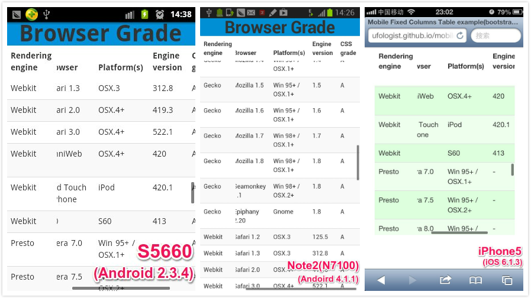

<a href="http://ufologist.github.io/mobile-fixed-columns-table">mobile-fixed-columns-table</a>
====================
在移动平台上(Android/iOS...)可用的固定列/表头的表格组件

v1.0.2 2015-9-24



测试过的手机
--------------------
* S5660        -- Android 2.3.4
* Note2(N7100) -- Android 4.1.1 / Android 4.1.2
* 小米1        -- Android 4.1.2
* GT-I8552     -- Android 4.1.2
* iPhone5      -- iOS 6.1.3

<a href="https://github.com/ufologist/mobile-fixed-columns-table/tree/android-demo">Android App Demo</a>
--------------------
基于phonegap来使用mobile-fixed-columns-table组件.


立刻扫描下面的二维码下载Android app体验吧!

<a href="https://github.com/ufologist/mobile-fixed-columns-table/raw/android-demo/bin/fixed-columns-table.apk"></a>

优势
--------------------
* 兼容Android 2.3.x, 弥补了FixedColumns的不足
* 表格可滚动区域会出现滚动条引导用户操作(iOS上需要tap后才出现), 弥补了FixedColumns的不足
* 没有为达到功能而改动FixedColumns及任何第3方依赖库的源码, 巧妙地借力用力, 因此可以使用FixedColumns原有的强大功能, 鱼和熊掌兼得...

使用方法
--------------------
```JavaScript
// 至少需要的参数
$('#table').mobileFixedColumnsTable({ // 请参考DataTables的配置
    'sScrollY': '300px',
    'sScrollX': '100%',
    'bScrollCollapse': true
});
```

```JavaScript
// 更多的配置项
$('#table').mobileFixedColumnsTable({
    'sScrollY': '300px',
    'sScrollX': '100%',
    'bScrollCollapse': true,
    'oLanguage': {
        'sInfo': ''
    }
}, {
    fixedColumnsOptions: { // 请参考DataTables的FixedColumns的配置
        iLeftColumns: 2
    },
    scrollerOptions: { // 请参考iScroll的配置
        onScrollMove: function() {
            console.log(this, arguments);
        }
    }
});
```

示例
--------------------
* <a href="http://ufologist.github.io/mobile-fixed-columns-table/mobile-fixed-columns-table-bootstrap.html">mobile fixed columns table与bootstrap一起使用</a>
* <a href="http://ufologist.github.io/mobile-fixed-columns-table/mobile-fixed-columns-table-democss.html">mobile fixed columns table与DataTables的demo.css一起使用</a>
* <a href="http://ufologist.github.io/mobile-fixed-columns-table/mobile-fixed-columns-table-long-header.html">mobile fixed columns table 支持超长表头</a>

依赖
--------------------
1. <a href="http://jquery.com/">jQuery</a>
2. <a href="http://www.datatables.net">DataTables</a> & <a href="http://www.datatables.net/extras/fixedcolumns/">FixedColumns</a>
3. <a href="http://cubiq.org/iscroll-4">iScroll</a>

changelog
--------------------
* v1.0.2 2015-9-24

  1. 修复由于 iScroll 选择以 absolute 方式移动子元素造成 dataTables_scrollHead "消失"的问题.

* v1.0.1 2013-10-11

  1. 修复一点点在用户体验上的问题, 即使页面区域还有剩余, 但表格总处于可滑动的状态出现垂直滚动条, 功能上倒是没什么影响.

想了解更多信息请访问<a href="http://ufologist.github.io/mobile-fixed-columns-table">项目主页</a>

其他 Responsive Tables 方案
--------------------
* [CSS only Responsive Tables](http://dbushell.com/2016/03/04/css-only-responsive-tables/)

  

  竟然还有 Scrolling shadows, 太高级了