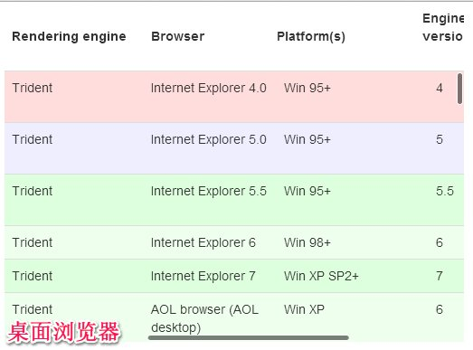
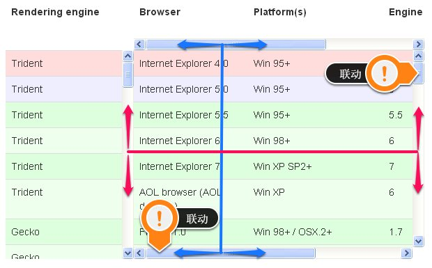
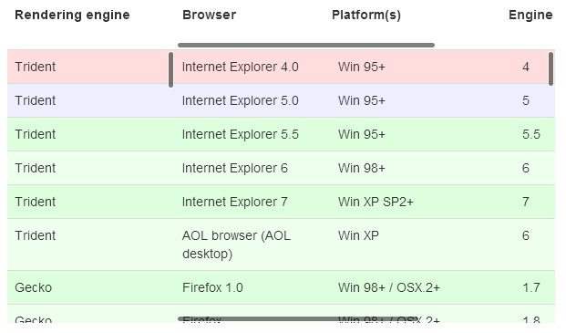

mobile-fixed-columns-table
====================
在移动平台上(Android/iOS...)可用的固定列/表头的表格组件

v1.0 2013-07-04



TODO 移动平台上的截图

测试过的手机
--------------------
* 小米1
* Note2(N7100)
* GT-I8552

使用方法
--------------------
```JavaScript
// 至少需要的参数
$('#table').mobileFixedColumnsTable({ // 请参考DataTables的配置
    'sScrollY': '300px',
    'sScrollX': '100%',
    'bScrollCollapse': true
});
```

```JavaScript
// 更多的配置项
$('#table').mobileFixedColumnsTable({
    'sScrollY': '300px',
    'sScrollX': '100%',
    'bScrollCollapse': true,
    'oLanguage': {
        'sInfo': ''
    }
}, {
    fixedColumnsOptions: { // 请参考DataTables的FixedColumns的配置
        iLeftColumns: 2
    },
    scrollerOptions: { // 请参考iScroll的配置
        onScrollMove: function() {
            console.log(this, arguments);
        }
    }
});
```

依赖
--------------------
1. <a href="">jQuery</a>
2. <a href="http://www.datatables.net">DataTables</a> && <a href="http://www.datatables.net/extras/fixedcolumns/">FixedColumns</a>
3. <a href="http://cubiq.org/iscroll-4">iScroll</a>

不是我想要造轮子
--------------------
为什么非要专门为移动平台包装这么一个组件?
主要是因为试过很多可以固定列/表头的表格组件, 在移动平台上使用都不理想.

例如:
* <a href="https://github.com/markmalek/Fixed-Header-Table">Fixed-Header-Table</a>
* <a href="http://www.datatables.net/extras/fixedcolumns/">DataTables - FixedColumns</a>
* <a href="http://docs.sencha.com/extjs/4.2.1/extjs-build/examples/build/KitchenSink/ext-theme-neptune/#locking-grid">Ext JS - Locking Grid</a>

其中最为理想的是FixedColumns, 但在<strong>Android 2.3.x</strong>strong>上(极有可能2.3之前的版本也无法使用, 但未测试过)无法使用, 试过在Android 4.x上一切正常.

但还是有一点点小瑕疵. 由于FixedColumns的实现机制是利用原生的滚动条来控制固定列/表头, 在移动平台上不会出现这个原生的滚动条, 因此会给人不爽的感觉.

想着是否需要参考这些已经成熟的固定列/表头的HTML结构, 自己来实现一个类似的组件, 让其兼容<strong>Android 2.3.x</strong>strong>?

深受启发
--------------------
某日看过某人随便写的一个可以在移动平台上使用的固定列/表头的组件, 虽是个半成品, 但深受启发, 原来使用iScroll来代替原生滚动条就行了, 就这么简单.

解析FixedColumns
--------------------
了解下FixedColumns的原理就豁然开朗了.

主要是通过做联动垂直/水平滚动条来实现滚动区域与固定区域保持一直


那么在Android 2.3.x上测试无法使用, 极有可能就是这些原生滚动条出了问题, 造成地无法滚动.

因此我们将这些原生滚动条都用iScroll来代替就好了, 再让iScroll联动


常见问题
--------------------
Q: 能集成bootstrap一起使用吗?

A: 本组件兼容使用bootstrap作为基础样式库, 但切记一定要覆盖bootstrap默认的table样式max-width: 100%为max-width: none, 否则会使表格宽度无法溢出, 造成不出现水平滚动条的问题.

github pages demo
--------------------
TODO